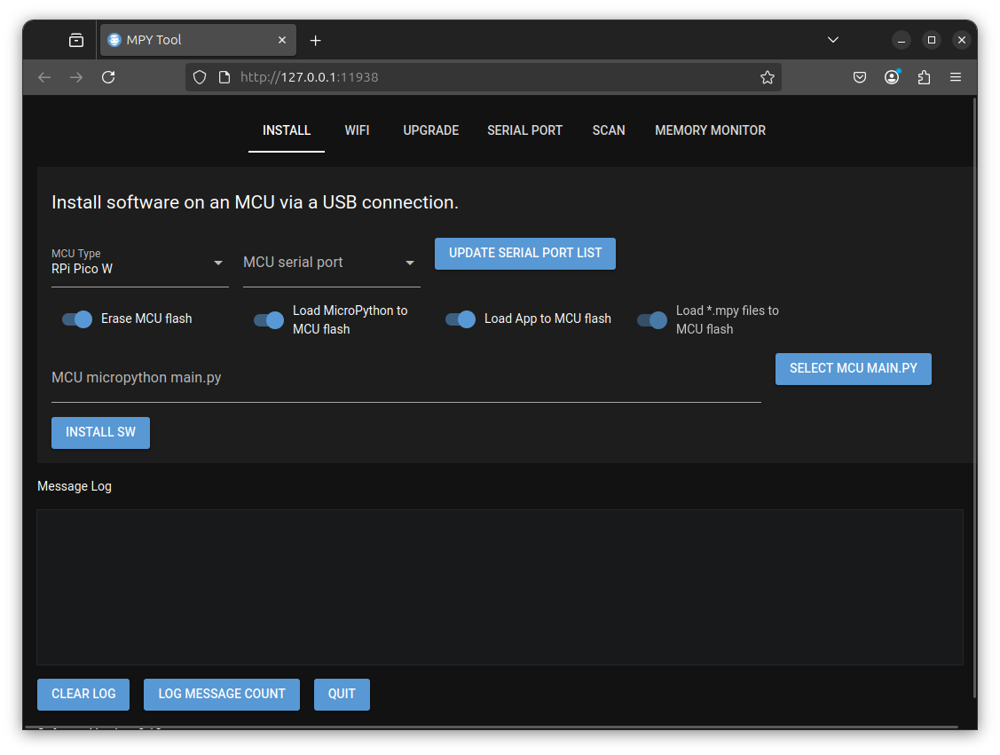
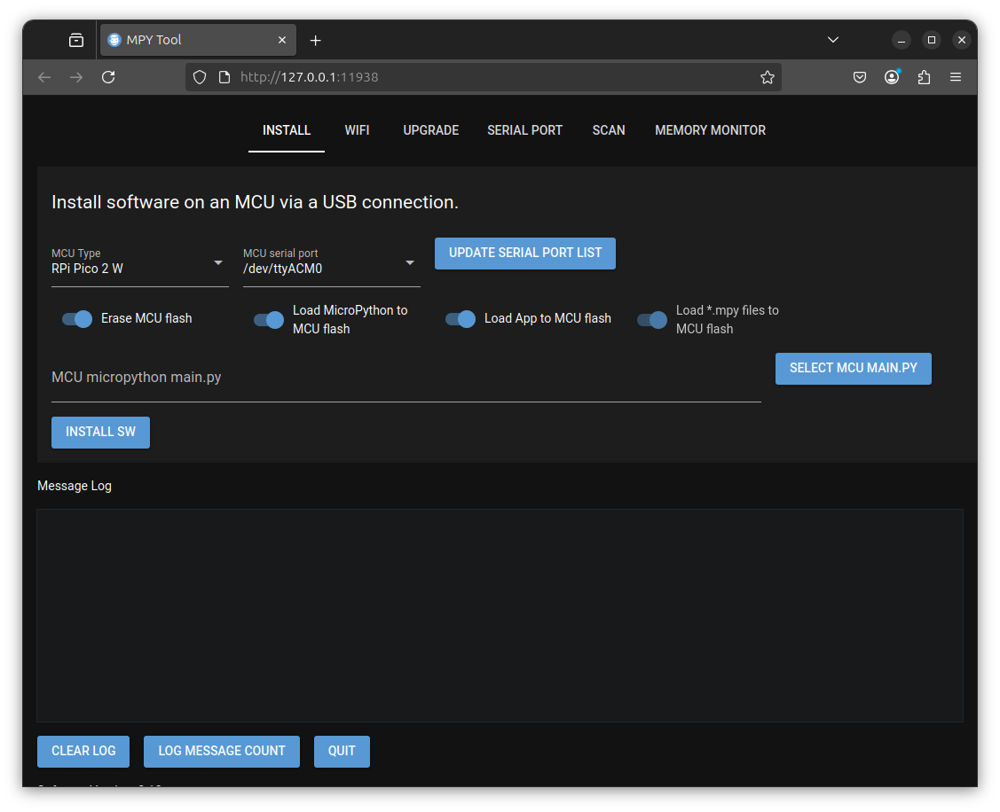
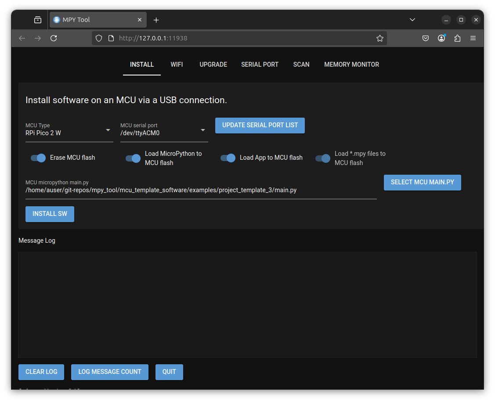
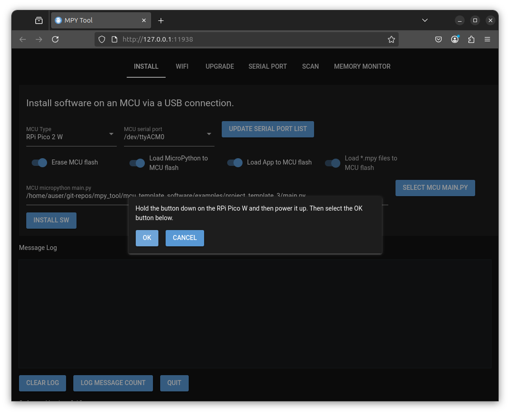

# MPY Tool project

This project provides a GUI (Graphical User Interface) tool with the following functionality

- Load MicroPython (MicroPython firmware and MicrPython program) onto Micro Controllers (MCU's).
  The currently supported list of MCU's is RPi Pico W, RPi Pico 2 W, esp32, esp32c3 and esp32c6.
- Setup the WiFi SSID and password on the above MCU's either using a USB port or via bluetooth connections.
- Upgrade a running MicroPython app on an MCU via a WiFi connection.
- Provide serial port debugging assistance.
- Scan function to read JSON data from MCU's running example code.
- Live plots of memory and disk usage while apps are running.

# MicroPython MCU application code

The repo includes template/example code. The GUI tool requires that template code is executed on the MCU to allow setting up the WiFi over Bluetooth, Upgrades over the air (OTA) and a webserver. The following example applications are provided as the starting point for implementing your chosen project functionality. The example code can be found in the /home/pja/git-repos/mpy_tool/mcu_template_software/examples folder of the git repo.

- Example 1
Minimal example. Click [here](mcu_template_software/examples/project_template_1/README.md) for more info.

- Example 2
As above but with the ability to setup the WiFi over USB or Bluetooth interface. Click [here](mcu_template_software/examples/project_template_2/README.md) for more info.

- Example 3
As above but with a webserver. Click [here](mcu_template_software/examples/project_template_3/README.md) for more info.

- Example 4
As above but with the ability to respond to are you there broadcast messages with stats in JSON format. Click [here](mcu_template_software/examples/project_template_4/README.md) for more info.

## Installation

The GUI tool has been tested on Linux and Windows platforms. The GUI Tool has been tested on 3.12.3 but should work with later versions. 

pipx must also be installed. Details of how to install pipx can be found [here](https://pipx.pypa.io/stable/installation/). 

Once pipx is installed ensure that you run the 

```
pipx ensurepath
```

command to ensure that python programs can be found in the path.

### Linux

The software is supplied as a python wheel file. This can be found in the desktop_software/linux folder.

To install the software run the following command from a terminal window.

```
pipx install desktop_software/linux/mpy_tool-0.12-py3-none-any.whl
  installed package mpy_tool 0.12, installed using Python 3.12.3
  These apps are now globally available
    - mpy_tool
    - mpy_tool_gui
    - mpy_tool_rshell
done! ✨ 🌟 ✨
```

The mpy_tool_gui command provides the functionality detailed above. The mpy_tool provides the same functionality from the command line. The mpy_tool_rshell command can be ignored as it is used internally.


#### dialout group membership

On Linux platforms you may not have access (as local user) to serial ports which is required by this software. 
To add access to serial ports run the following command from a terminal window.

```
sudo usermod -aG dialout $USER
[sudo] password for auser: 
```

Follow this by to reload group membership

'''
newgrp dialout
'''

Checking that you are now a member of the dialout group

```
groups
dialout adm cdrom sudo dip plugdev users lpadmin auser
```


#### Create Gnome Application Launcher Icon

If you have a Linux distribution that supports gnome application launchers you can create a gnome desktop launcher by running the following command.

```
mpy_tool_gui -a
INFO:  Created gnome desktop application launcher
```

A gnome application launcher should now be available as shown below (press Windows key and enter mpy to view on Ubuntu) which can be used to start the mpy_tool_gui program.


### Windows

The software is supplied as a python wheel file. This can be found in the desktop_software/windows folder. To install the software run the following command from a power shell window.

```
pipx install desktop_software/windows/mpy_tool-0.12-py3-none-any.whl
  installed package mpy_tool 0.12, installed using Python 3.12.3
  These apps are now globally available
    - mpy_tool
    - mpy_tool_gui
    - mpy_tool_rshell
done! ✨ 🌟 ✨
```

#### Create Windows Shortcut Icon

You may now create a Windows shortcut to launch the mpy_tool_gui program.

```
mpy_tool_gui.exe -a
INFO:  C:\Users\pja\pipx\venvs\mpy-tool\Lib\site-packages\assets\icon.ico icon file found.
INFO:  C:\Users\pja\Desktop\mpy_tool_gui.lnk shortcut created.
```

The shortcut should be available from the windows start button (enter mpy to find it) and it's icon is the ame as shown above for the Linux version.


# Starting the software
The mpy_tool_gui program may be started by wither of the options shown below

## Linux
- Opening a terminal window and entering 'mpy_tool_gui. You may use the -d argument to show debugging information in the Message Log window (-h gives command line help).
- Selecting the gnome application launcher on Linux platforms.

## Windows

- Opening a powershell window and entering mpy_tool_gui.exe. You may use the -d argument to show debugging information in the Message Log window (-h gives command line help).
- Selecting the windows shortcut on Windows platforms.


Once started a web browser window is opened as shown below




# Installing onto an MCU

The example MicroPython applications can be installed onto an MCU as shown below. These example 
applications can be modified to add the functionality required for your project. 
For the example below example 3 code is installed onto a RPi Pico 2 W (the latest Raspberry Pi Pico hardware).

- Select the MCU Type ('RPi Pico 2 W' in this case).
- Plug in a USB cable between the PC running the mpy_tool_gui software (GUI) and the RPi Pico 2 W.
- Select the 'UPDATE SERIAL PORT LIST' button in the GUI. If running on a Linux platform you should 
  see the MCU Serial Port field updated as shown below.



- Then you need to select the MicroPython program that you wish to load. To do this the main.py file must 
  be selected using the 'SELECT MCU MAIN.PY' button as shown below.
  


- The four options (blue switch widgets) available should all be selected initially. Once MicroPython has 
been loaded the first two (from the left) can be switch off unless you wish to Wipe the MCU flash and 
reload MicroPython to it.
- Select the 'INSTALL SW' button to load the MCU. You are then prompted as shown below.



- At this point remove the USB connected from the 'RPi Pico 2 W', hold the button down on the 'RPi Pico 2 W' and plug the USB connector back in (while holding the button down). This causes the 'RPi Pico 2 W' flash to be mounted as a drive.
- Select the OK button to continue.

The MCU installation process should now continue. An example of the text displayed in the Message Log window is shown below.

```

```

