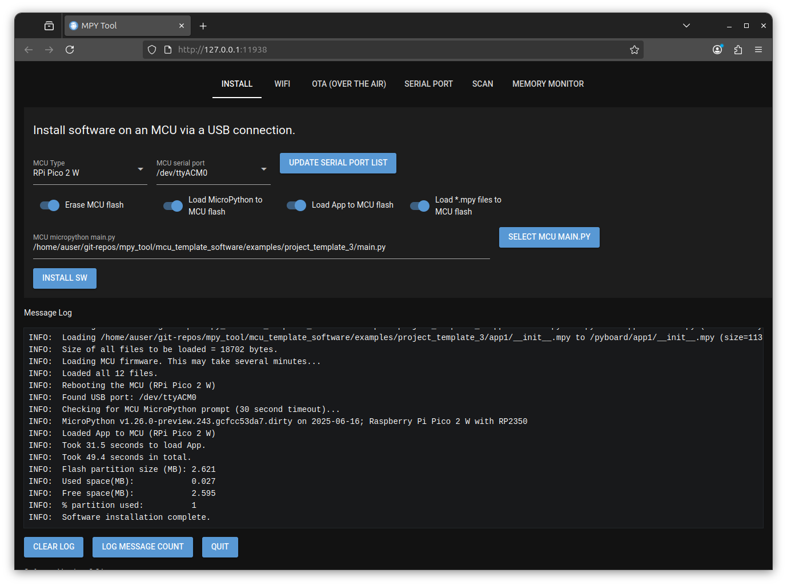
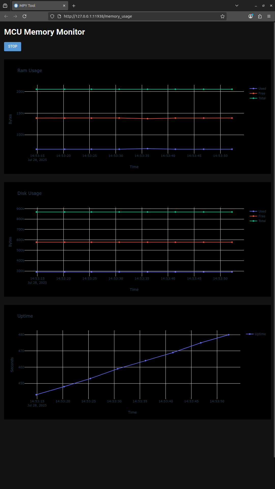

# MPY Tool project

This project provides a GUI (Graphical User Interface) tool with the following functionality

- Load MicroPython (MicroPython firmware and MicrPython program) onto Micro Controllers (MCU's).
  The currently supported list of MCU's is RPi Pico W, RPi Pico 2 W, esp32, esp32c3 and esp32c6.
- Setup the WiFi SSID and password on the above MCU's either using a USB port or via bluetooth connections.
- Upgrade a running MicroPython app on an MCU via a WiFi connection.
- Provide serial port debugging assistance.
- Scan function to read JSON data from MCU's running example code.
- Live plots of memory and disk usage while apps are running.

## Installation

The GUI tool has been tested on Linux, Windows and Mac platforms.

### Linux

The software is supplied as a python wheel file. This can be found in the desktop_software/linux folder of the git repo.

Python of at least version 3.12 should be installed on the Linux system.

pipx must also be installed. See https://pipx.pypa.io/latest/installation/ for details of how to install pipx.

Once python and pipx are installed the mpy_tool package can be installed as shown below by running a command from a terminal window.

```
pipx install desktop_software/linux/mpy_tool-0.12-py3-none-any.whl
  installed package mpy_tool 0.12, installed using Python 3.12.3
  These apps are now globally available
    - mpy_tool
    - mpy_tool_gui
    - mpy_tool_rshell
done! ✨ 🌟 ✨
```

The mpy_tool_gui command provides the functionality detailed above. The mpy_tool provides the similar functionality from the command line. The mpy_tool_rshell command can be ignored as it is used internally by the other two commands.


#### dialout group membership

On Linux platforms you may not have access (as local user) to serial ports which is required by this software.
To add access to serial ports run the following command from a terminal window.

```
sudo usermod -aG dialout $USER
[sudo] password for auser:
```

Follow this by to reload group membership. You may also logout and log back in to the system.

'''
newgrp dialout
'''

Checking that you are now a member of the dialout group

```
groups
dialout adm cdrom sudo dip plugdev users lpadmin auser
```


#### Create Gnome Application Launcher Icon

If you have a Linux distribution that supports gnome application launchers you can create a gnome desktop launcher by running the following command.

```
mpy_tool_gui -a
INFO:  Created gnome desktop application launcher
```

A gnome application launcher should now be available as shown below (press Windows key and enter mpy to view on Ubuntu) which can be used to start the mpy_tool_gui program.


### Windows

Python of at least version 3.12 should be installed on the Windows system. Python installers for windows can be found at https://www.python.org/downloads/windows/

pipx must also be installed. See https://pipx.pypa.io/latest/installation/ for details of how to install pipx.


The software is supplied as a python wheel file. This can be found in the desktop_software/windows folder. To install the software run the following command from a power shell window.

```
pipx install desktop_software/windows/mpy_tool-0.12-py3-none-any.whl
  installed package mpy_tool 0.12, installed using Python 3.12.3
  These apps are now globally available
    - mpy_tool
    - mpy_tool_gui
    - mpy_tool_rshell
done! ✨ 🌟 ✨
```

#### Create Windows Shortcut Icon

Once installed you may create a Windows shortcut to launch the mpy_tool_gui program.

```
mpy_tool_gui.exe -a
INFO:  C:\Users\pja\pipx\venvs\mpy-tool\Lib\site-packages\assets\icon.ico icon file found.
INFO:  C:\Users\pja\Desktop\mpy_tool_gui.lnk shortcut created.
```

After executing the above command you should find the icon below on the Windows desktop. You should be able to double click this to start the mpy_tool_gui program.


## MacOS

The software is supplied as a python wheel file. The MacOS installer is the same as the Linux installer and can be found in the desktop_software/linux folder of the git repo.

Python of at least version 3.12 should be installed on the MacOS system. Python installers for MacOS can be found at https://www.python.org/downloads/macos/

pipx must also be installed. See https://pipx.pypa.io/latest/installation/ for details of how to install pipx.

Once python and pipx are installed the mpy_tool package can be installed as shown below by running a command from a terminal window.

```
pipx install desktop_software/linux/mpy_tool-0.12-py3-none-any.whl
  installed package mpy_tool 0.12, installed using Python 3.12.3
  These apps are now globally available
    - mpy_tool
    - mpy_tool_gui
    - mpy_tool_rshell
done! ✨ 🌟 ✨
```

The mpy_tool_gui command provides the functionality detailed above. The mpy_tool provides the similar functionality from the command line. The mpy_tool_rshell command can be ignored as it is used internally by the other two commands.

#### Create a desktop launcher icon
Once installed you may create a desktop icon to launch the mpy_tool_gui program.

Run the following command from a terminal window to create the desktop launcher icon.

```
mpy_tool_gui -a
INFO:  Created /Users/pja/Desktop/MPY_Tool.app
```

After executing the above command you should find the icon below on the desktop. You should be able to double click this to start the mpy_tool_gui program.


Note that the first time you start the mpy_tool_gui program it may take some time to start up.


# Starting the software
The mpy_tool_gui program may be started by wither of the options shown below

## Linux
- If you created the gnome application launcher icon you can double click it or
- Open a terminal window and enter 'mpy_tool_gui. You may use the -d argument to show debugging information in the Message Log window (-h gives command line help).


## Windows
- If you created the windows desktop launcher icon you can double click it or
- Open a powershell window and enter mpy_tool_gui.exe. You may use the -d argument to show debugging information in the Message Log window (-h gives command line help).

## MacOS
- If you created the desktop launcher icon you can double click it or
- Open a terminal window and enter mpy_tool_gui. You may use the -d argument to show debugging information in the Message Log window (-h gives command line help).


Once started a web browser window is opened as shown below


# Installing onto an MCU

The example MicroPython applications can be installed onto an MCU as shown below. These example
applications can be modified to add the functionality required for your project.

## MicroPython MCU application code

The repo includes template/example code (mcu_template_software/examples git repo folder). The GUI tool requires that template code is executed on the MCU to allow setting up the WiFi over Bluetooth, Upgrades over the air (OTA), running a webserver and discovering devices on a network.

The following example applications are provided as the starting point for implementing your chosen project functionality. The example code can be found in mcu_template_software/examples folder of the git repo.

- Example 1

    Minimal example. Click [here](mcu_template_software/examples/project_template_1/README.md) for more info.

- Example 2

  As above but with the ability to switch between app1 and app2. Click [here](mcu_template_software/examples/project_template_2/README.md) for more info.

- Example 3

  As above but with the ability to setup the WiFi over USB or Bluetooth interface. Click [here](mcu_template_software/examples/project_template_3/README.md) for more info.

- Example 4

  As above but with a webserver. Click [here](mcu_template_software/examples/project_template_4/README.md) for more info.

- Example 5

  As above but with the ability to respond to are you there broadcast messages with stats in JSON format. Click [here](mcu_template_software/examples/project_template_5/README.md) for more info.

- Example 6

  As above but with the ability to connect to a WebREPL prompt using a browser. Click [here](mcu_template_software/examples/project_template_6/README.md) for more info.

- Example 7

  This has less functionality than the previous example. It allows the user to setup the WiFi using USB or bluetooth connections. Once connected to the WiFi
the WebREPL interface is available. Click [here](mcu_template_software/examples/project_template_7/README.md) for more info.

## Installing software onto a new MCU

For the example below, example 3, code is installed onto a RPi Pico 2 W (the latest Raspberry Pi Pico hardware).

- Select the MCU Type ('RPi Pico 2 W' in this case).
- Plug in a USB cable between the PC running the mpy_tool_gui software (GUI) and the RPi Pico 2 W.
- Select the 'UPDATE SERIAL PORT LIST' button in the GUI. If running on a Linux platform you should
  see the MCU Serial Port field updated as shown below.


- Then you need to select the MicroPython program that you wish to load. To do this the main.py file must
  be selected using the 'SELECT MCU MAIN.PY' button as shown below.


- The four options (blue switch widgets) available should all be selected initially. Once MicroPython has
been loaded the first two (from the left) can be switch off unless you wish to wipe the MCU flash and
reload MicroPython to it.
- Select the 'INSTALL SW' button to load the MCU. You are then prompted as shown below.


- At this point remove the USB connector from the 'RPi Pico 2 W', hold the button down on the 'RPi Pico 2 W' and reconnect it (while holding the button down). This causes the 'RPi Pico 2 W' flash to be mounted as a drive.
- Select the OK button to continue.

The MCU installation process should now continue. When complete the Message Log window should show.



## Setting up WiFi

You must have previously loaded project_template_3 or higher the setup the WiFi using the SETUP WIFI option in the WIFI tab. Once configured, when the MCU boots it will attempt to connect to the WiFi network.

### Setting up WiFi using a USB connection.

- Select the USB radio button
- Select the SETUP WIFI button


- Select the OK button

The Wifi should then be setup. The message log window should show

```
INFO:  Checking for a USB connected MCU.
INFO:  MCU: RPi Pico 2 W.
INFO:  Found USB port: /dev/ttyACM0
INFO:  Asserting esp32 hardware reset.
INFO:  Released esp32 hardware reset.
INFO:  Checking for MCU MicroPython prompt (30 second timeout)...
INFO:  MicroPython v1.26.0-preview.243.gcfcc53da7.dirty on 2025-06-16; Raspberry Pi Pico 2 W with RP2350
INFO:  Running App on the MCU device. Waiting for WiFi connection...
INFO:  Rebooting the MCU (RPi Pico 2 W)
INFO:  Found USB port: /dev/ttyACM0
INFO:  Checking for MCU MicroPython prompt (30 second timeout)...
INFO:  MicroPython v1.26.0-preview.243.gcfcc53da7.dirty on 2025-06-16; Raspberry Pi Pico 2 W with RP2350
INFO:  MCU IP address = X.X.X.X
INFO:  WiFi is now configured on MCU.
INFO:  Took 15.7 seconds.
INFO:  WiFi setup complete.
```

You should then be able to ping the MCU on the IP address displayed.

### Setting up WiFi using a Bluetooth connection.

You must have bluetooth enabled on your machine to be able to configure the MCU WiFi interface via bluetooth.

- Select the Bluetooth radio button
- Select the SETUP WIFI button
- A dialog box is displayed telling you to hold down the WiFi button on the MCU until the WiFi LED flashes. If you have just used the INSTALL tab to load software onto an MCU then it will be in this state, ready to setup the WiFi.

See the mcu_template_software/examples/project_template_4/README.md or mcu_template_software/examples/project_template_5/README.md files for details of the GPIO pins allocated for the WiFi button and the WiFi indicator LED.

- When OK button is selected a scan for bluetooth devices is performed. When a connection is made to the MCU a command is sent to it instructing the MCU to perform a scan of the WiFi networks that it can see. When this is complete a list of the WiFi networks is displayed in the message log and a dialog is presented showing the SSID's found. You may select an SSID from this list and this will be copied to the 'WiFi SSID' field in the dialog. If you know the SSID of the network you wish to connect to but it is not displayed in the list of SSID's found (a hidden SSID) you may enter the WiFi SSID directly. Enter the WiFi password and then select the OK button in the dialog.

- The WiFi SSID and password will then be sent to the MCU over the bluetooth connection and the MCU will restart.

- When the MCU connects to the WiFi network it will show the following messages in the message log.

```
INFO:  Setting up YDev WiFi...
INFO:  Waiting for YDev device to restart...
INFO:  Waiting for YDev device WiFi to be served an IP address by the DHCP server...
INFO:  YDev device IP address = X.X.X.X
INFO:  Turning off bluetooth interface on YDev device.
INFO:  Device now restarting...
INFO:  Waiting for the MCU to reconnect to the WiFi network.
INFO:  X.X.X.X ping success.
INFO:  Device WiFi setup complete.
```

You should then be able to ping the MCU on the IP address displayed.


## Upgrading MicroPython App over the air.

You must have previously loaded project_template_4 or project_template_5 to use the UPGRADE APP option in the 'OTA (OVER THE AIR)' tab.

When the 'OTA (OVER THE AIR)' tab is selected the Device address must be entered as the Device address of the MCU to be upgraded.

By default the 'Load *.mpy files to MCU flash' options is selected. When selected the python files (*.py) will be converted to python bytecode files (*.mpy) before being loaded. The python bytescode files are smaller and so take up less MCU flash space. If the 'Load *.mpy files to MCU flash' options is not selected then the python (*.py) files are loaded onto the MCU flash.

You must select the main.py file in the project_template_4 or project_template_5 folder or modified versions of these for your project so that the code loaded to the MCU retains the ability to be upgraded over the air.

Select the UPGRADE APP button and the all the files in the folder (all files including python files) in or under the main.py will be loaded onto the MCU over the air interface of the MCU.

The message log should show messages similar to that below when the upgrade is complete

```
INFO:  Sent /home/auser/git-repos/mpy_tool/mcu_template_software/examples/project_template_4/app1/__init__.mpy to 192.168.0.80:/app1 (size=113 bytes)
INFO:  Total size of all files loaded to the MCU: 123505 bytes.
INFO:  App size (MB):        0.123505
INFO:  Max app size (MB):    0.434176
INFO:  Took 69.2 seconds to upgrade device.
INFO:  Rebooting the device.
INFO:  Waiting for the MCU (192.168.0.80) to reboot.
INFO:  The MCU has rebooted.
INFO:  Waiting for the MCU to reconnect to the WiFi network.
INFO:  192.168.0.80 ping success.
INFO:  Upgrade successful. Switched from /app2 to /app1
INFO:  Flash size (MB):  0.868352
INFO:  Used (MB):        0.401408
INFO:  % space left:     53.8
INFO:  Took 86.2 seconds.
INFO:  Upgrade complete.
```

## Resetting the WiFi configuration

### Via the app
The mpy_tool_gui app allows you to reset the WiFi configuration if the MCU is currently connected to the WiFi network.

- Select the OTA (OVER THE AIR) tab
- Enter the Device IP address
- Select the RESET WIFI CONFIGURATION button.

The Message log should then show messages similar to those shown below

```
INFO:  Reset the WiFi config for the MCU at 192.168.0.80.
INFO:  Reset MCU WiFi configuration..
INFO:  Rebooting the device.
INFO:  WiFi config has been reset and the MCU is rebooting.
```

Once rebooted its WiFi configuration is unset. You may then setup the WiFi configuration as detailed previously.

### Via the WiFi button

If you have a button connected to the WiFi GPIO pin (See [WIFI_SETUP_GPIOS.md](mcu_template_software/project_template_4/WIFI_SETUP_GPIOS.md) for details of this) then you can hold this button down for 5 seconds or so and the MCU should reset it's WiFi configuration and reboot. Once rebooted its WiFi configuration is unset. You may then setup the WiFi configuration as detailed previously.


## Viewing MCU serial port output.

The MCU sends information on it's serial port. When developing programs to run on the MCU it is useful to view this output. The SERIAL PORT tab allows you to do this.

- Plug in your MCU to a USB port on the machine with the mpy_tol_gui app running.
- Select the SERIAL PORT tab
- Select the UPDATE SERIAL PORT LIST button
- Ensure the 'MCU serial port' field has the serial port connected to the MCU selected.
- Select the OPEN button.

The serial port is not connected to the MCU, you should now see messages from the MCU.

Once connected the CTRL C, CTRL B, CTRL D and SEND buttons are highlighted

- CTRL C
Sends an ASCII CTRL C character on the serial port which should stop the MCU running a program and return the python REPL prompt (>>> ).

- CTRL B
Sends an ASCII CTRL B character on the serial port which should return a line of text that reports details of MicroPython and the MCU it's running on assuming CTRL C was used to obtain the python REPL prompt.

E.G

```
MicroPython v1.26.0-preview.243.gcfcc53da7.dirty on 2025-06-16; Raspberry Pi Pico W with RP2040
```

- CTRL D
Sends an ASCII CTRL B character on the serial port which should attmpt to restart the program (run main.py) on the MCU flash.

The following shows the program starting when the MCU has been loaded with project_template_5 and has it's WiFi interface configured.

```
MCU serial port
HW Reset ESP32
Text to send
Message Log
INFO:  /dev/ttyACM0:
MPY: soft reboot
DEBUG: active_app=1
INFO:  /dev/ttyACM0: INFO:  Started app
INFO:  Running app1
INFO:  Total RAM (bytes) 205440, Free 157968, Used 47472, uptime 0
DEBUG: MCU: Raspberry Pi Pico W with RP2040
INFO:  WiFi LED GPIO:      16
INFO:  WiFi RESET GPIO:    14
INFO:  Bluetooth LED GPIO: None
DEBUG: wifi_status=3
DEBUG: connected
INFO:  IP Address=192.168.0.80
INFO:  /dev/ttyACM0: app_task(): count = 0
Starting async server on 0.0.0.0:80...
INFO:  /dev/ttyACM0: app_task(): count = 1
INFO:  /dev/ttyACM0: app_task(): count = 2
```

- CLOSE
This will close the serial port. If you wish to use other tabs that use the serial port (E.G INSTALL) you will need to close the serial port so that it is available for use.

## Scan for MCU's on the network

The SCAN tab of the mpy_tool_gui app allows you to search for and receive stats from MCU's on the network if they have had project_template_5 loaded.

- Select the SCAN tab
- Select the Scan Port from the pulldown list. This should be set to YDEV:2934 if project_template_5 was loaded onto your MCU. CT6:29340 cam be used to read stats from CT6 devices. CT6 devices are energy monitoring devices. More information on CT6 devices can be found at https://github.com/pjaos/ct6_meter_os.
- Enter the required Scan Period in seconds (1 second minimum).
- You may optionally enter the IP address of a single unit if you only wish to see responses from a single unit.
- Select the SCAN button.

The example below shows the message log when a single MCU loaded with project_template_5 is connected to the WiFi network.

```
INFO:  Sending AYT messages every second.
INFO:  Listening on UDP port 2934
INFO:  {
    "OS": "MicroPython",
    "DEVICE_TYPE": "DEV_TYPE",
    "UNIT_NAME": "DEV_NAME",
    "PRODUCT_ID": "PRODUCT_ID",
    "SERVICE_LIST": "web:80",
    "IP_ADDRESS": "192.168.0.80",
    "GROUP_NAME": ""
}
INFO:  Scan complete.
```

## Monitoring MCU memory

It is possible to plot the memory usage while an MCU is running a program assuming it has a connected WiFi interface. Either project_template_4 or project_template_5 (or your project bases upon one of these) must be running on the MCU. To do this the mpy_tool_gui

- Select the MEMORY MONITOR tab
- Enter the MCU device IP address.
- Enter the poll period for reading the memory stats.
- Select the START button.

A new browser window should open and it show the memory usage as shown below.



To stop the memory monitor select the STOP button at the top of the page. This stops the memory monitor. It does not stop the mpy_tool_gui app that created it.


